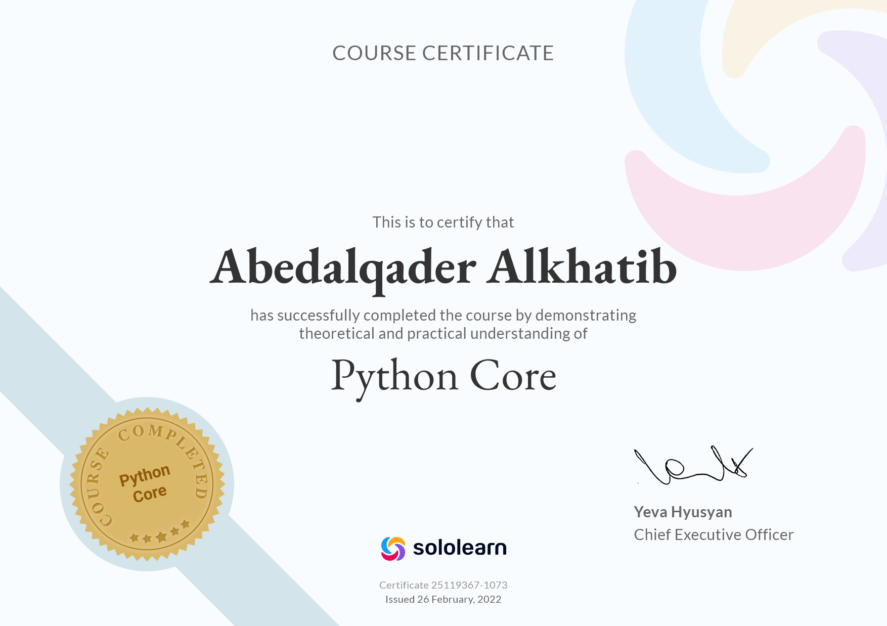
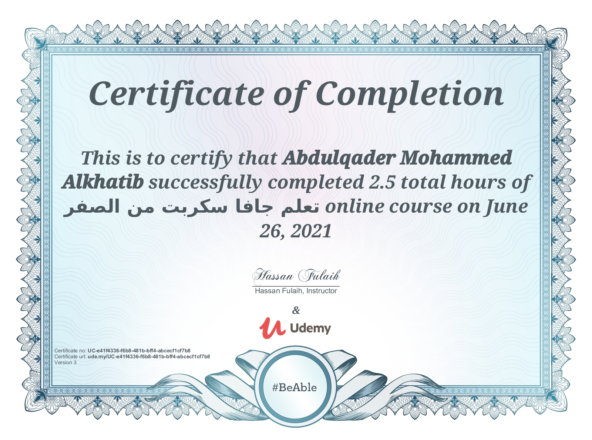
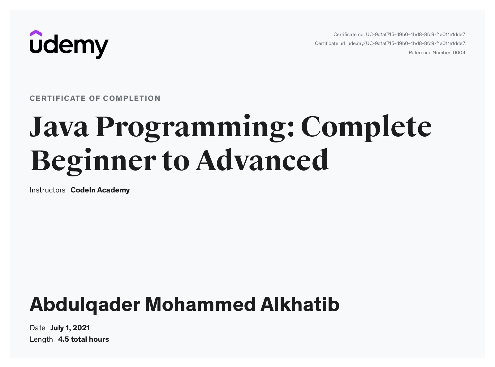

# Abedalqader Alkhatib

 

<h1>overview</h1> 

 Full-stack web developer & Mobile Developer on flutter Platform.
  Recently gradutes in `10/2021`,

  Atended a python developer course at @ASAC.

---

 

<h3>  It's the perfect way to showcase your skils   </h3>

---

[**MyResume** ](./Abedalqader_Cv%20(1).pdf)

[**My LinkedIn** ](https://www.linkedin.com/in/abdulqader-alkhatib-850453216/)

 
 
---

---

## Courses 

- **Python Core**
    * 
    * ['The Link'](https://www.sololearn.com/certificates/course/en/25119367/1073/landscape/png)
- **JavaScript-From-Zero**
    * 
    * ['The Link'](https://www.udemy.com/certificate/UC-e41f4336-f6b8-481b-bff4-abcecf1cf7b8/)
- **Java Beginner to advance**
    * 
    * ["The Link"](https://www.udemy.com/certificate/UC-9c1af715-d9b0-4bd8-8fc9-f1a011e1dde7/)